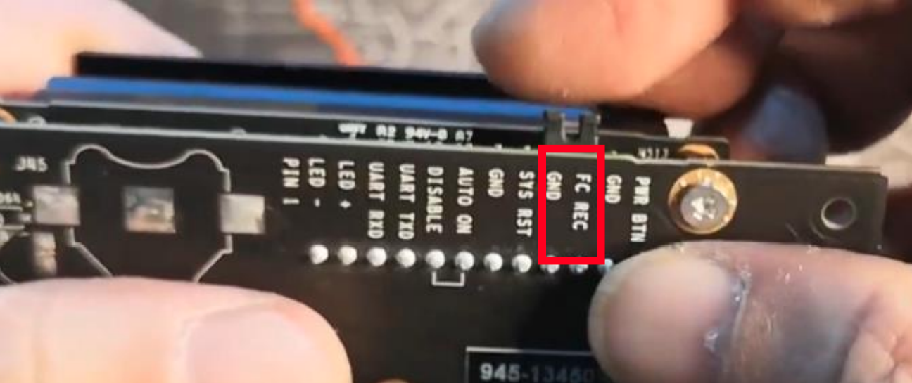
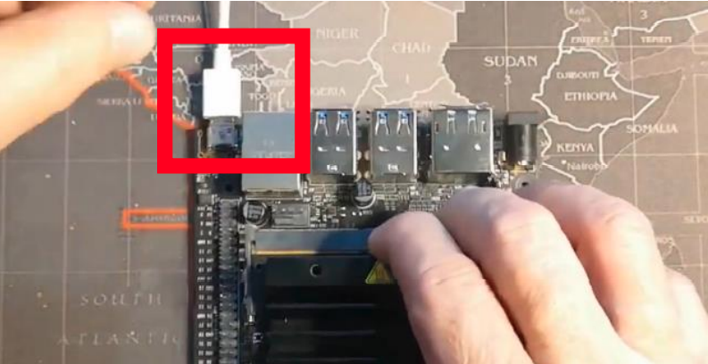
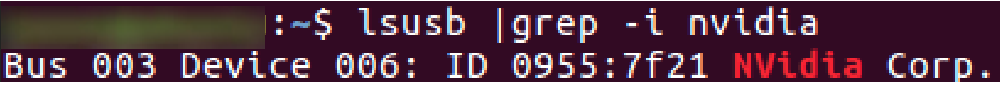
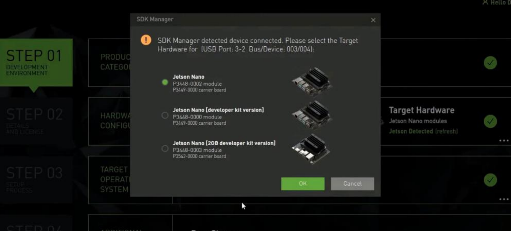
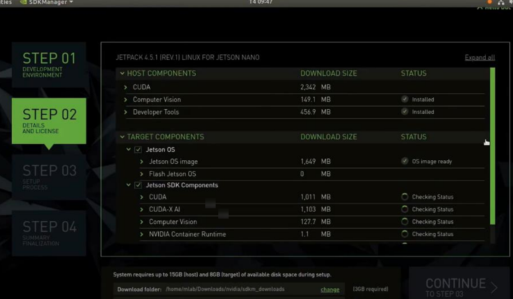
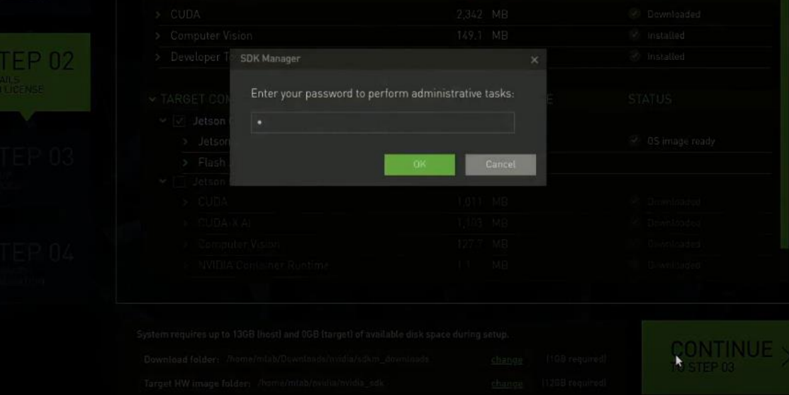
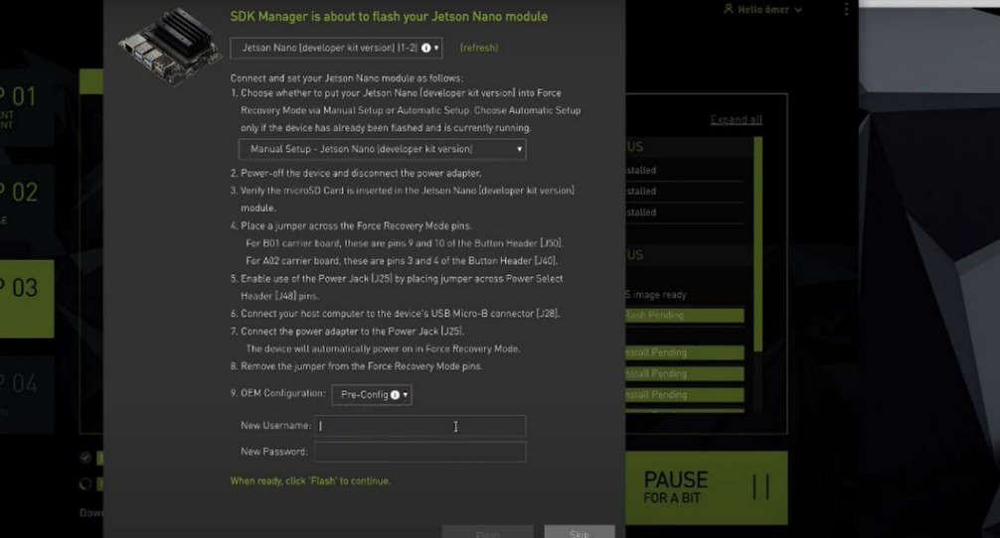
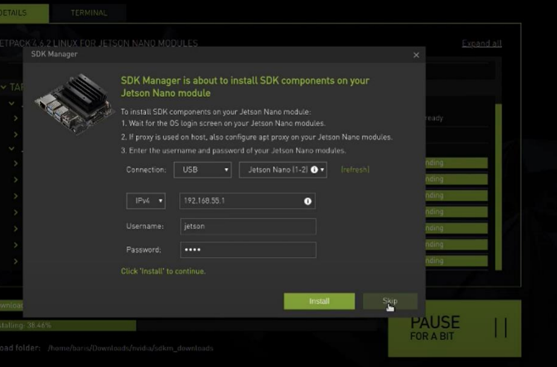
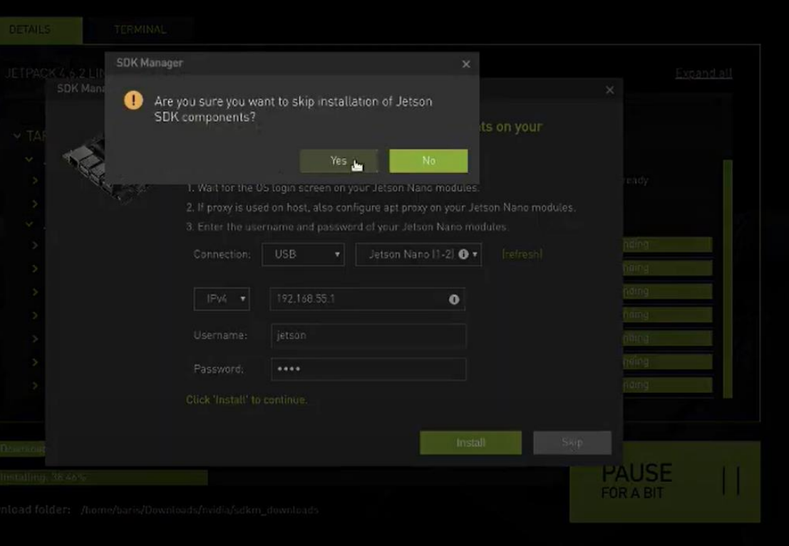
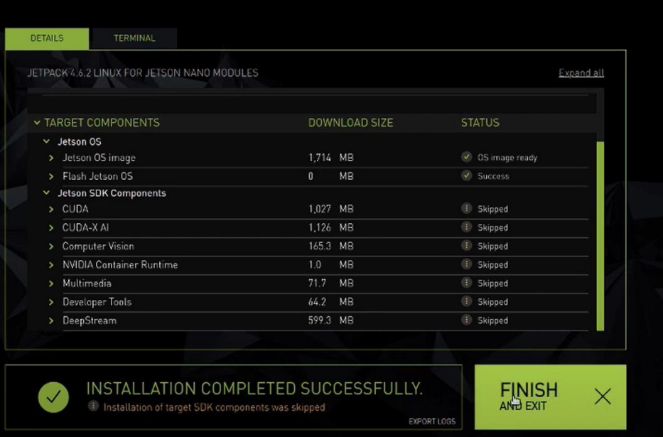

# Prepare-jetson-nano
## 👓🖱️💻🖥️ ขั้นตอนเตรียมการสำหรับ Jetson-nano
### Jetson nano
#### $\color[rgb]{1,0,1}1.$ $\color[rgb]{1,0,1}เเบบ$ $\color[rgb]{1,0,1}SD$ $\color[rgb]{1,0,1}card$
<code>https://developer.nvidia.com/embedded/learn/get-started-jetson-nano-devkit#intro</code>
##### $\color[RGB]{101, 240, 21}2.$ $\color[RGB]{101, 240, 21}แบบ$ $\color[RGB]{101, 240, 21}EMMC$ $\color[RGB]{101, 240, 21}/$ $\color[RGB]{101, 240, 21}Flash$
<p>$\color[RGB]{101, 240, 21}2.1$ Install the SDK Manager ติดตั้งใน Ubuntu 16.04, 18.04, or Ubuntu 20.04 ที่เป็น arm64</p>

> **Warning**
> ควรตรวจสอบดีๆในการลงไม่เช่นนั้นมันจะทำการติดตั้งทับกับในเครื่องเรา เพราะ NVIDIA เเนะนำให้ติดตั้งในเเบบจำลองเช่น VM WARE ที่เป็น ubuntu เพราะเซฟสุดถึงเเม้เกิดไรขึ้นก็ไม่เป็นไร!

<a href="https://developer.nvidia.com/drive/sdk-manager"><code>https://developer.nvidia.com/drive/sdk-manager</code></a>
<br><br>
<p align="center">
  
</p>
<p>$\color[RGB]{101, 240, 21}2.2$ เปิด terminal ไปที่โฟลเดอร์ที่ดาวน์โหลดเก็บไว้และติดตั้ง(ตัวอย่างเช่น Downloads)</p>

```
cd ~/Downloads
```
```
sudo apt install ./sdkmanager_[version]-[build#]_amd64.deb
```
<p>$\color[RGB]{101, 240, 21}2.3$ เปิดตัว NVIDIA SDK Manager </p>
  
```
sdkmanager
```
<p>$\color[RGB]{101, 240, 21}2.3$ ล็อกอิน NVIDIA SDK Manager</p>
<br>
<p align="center">
  
</p>

<p>$\color[RGB]{101, 240, 21}2.4$ เลือก jetpack ที่จะติดตั้ง</p>
<br>
<p align="center">
  
</p>

> **Note**
> *แนะให้เอา Deepsteam ออกเพื่อไม่ให้การ Flash ข้อมูลเกินจาก ตัว eMMC ถ้ามีแค่16GB 
<p>$\color[RGB]{101, 240, 21}2.5$ ใช้สายจั๊บ หรือ อุปกรณ์อื่นที่สามารถเชื่อมขา pin $\color[RGB]{200, 1, 10}FC$ $\color[RGB]{200, 1, 10}REC$ กับ $\color[RGB]{105,105,105}GND$ ได้
</p>
<br>
<p align="center">
  
</p>
<p>$\color[RGB]{101, 240, 21}2.6$ เสียบสาย USB เข้ากับตัว jetson nano </p>
<br>
<p align="center">
  
</p>

> **Note**
> **แนะนำ ควรเสียบสาย LAN อีกอันเพื่อกัน ip หลุดการเชื่อมหรือคง ip ไว้ในบางช่วงที่ Flash และกันการขาดตอนระหว่างช่วงของการ Flash
<p>$\color[RGB]{101, 240, 21}2.7$ เสียบสาย power </p>
<br>
<p align="center">
  
</p>
<p>$\color[RGB]{101, 240, 21}2.8$ เช็ค port การเชื่อมต่อของ jetson nano เพื่อเช็คว่ามีการเชื่อมต่อหรือไม่</p>

```
lsusb | grep -i nvidia
```
<p align="center">
  
</p>
<p>$\color[RGB]{101, 240, 21}2.9$ เลือก Hardware ตัว borad $\color[RGB]{127,255,212}(step1)$</p>
<br>
<p align="center">
  
</p>
<p>$\color[RGB]{101, 240, 21}2.10$ ดาวน์โหลดไฟล์ต่างๆที่จำเป็นต่อการ Flash และการเรียกใช้งาน $\color[RGB]{127,255,212}(step2)$</p>
<br>
<p align="center">
  
</p>
<p>$\color[RGB]{101, 240, 21}2.10.1$ เมื่อทำ $\color[RGB]{127,255,212}step2$ ให้กด continue และทำการล็อกอินรหัส user</p>
<br>
<p align="center">
  
</p>
<p>$\color[RGB]{101, 240, 21}2.11$ ทำการเชื่อมต่อกับ board และเริ่มต้นการ Flash $\color[RGB]{127,255,212}(step 3)$</p>
<p>  หัวข้อที่1 ให้เลือกเป็น Manual Setup ดังรูป ถ้าใน ข้อ $\color[RGB]{101, 240, 21}2.9$ เป็น jetson nano เช่น </p>

- ข้อ $\color[RGB]{101, 240, 21}2.9$ เลือกเป็น borad jetson nano ให้เลือกเป็น Manual Setup – jetson nano
- ข้อ $\color[RGB]{101, 240, 21}2.9$ [developer kit version] ให้เลือกเป็น Manual Setup–jetson nano[developer kit version] เป็นต้น

<p align="center">
  
</p>

<p><b>เเละตั้ง UserName และ password</b></p>
<p>$\color[RGB]{101, 240, 21}2.12$ ถ้าต้องการติด SDK components ให้ทำการกรอกข้อมูลดังรูป และทำการกด install ถ้าไม่ต้องการให้ทำการกด Skip และกด yes เป็นอันเสร็จ $\color[RGB]{127,255,212}(step 4)$</p>
<br>
<p align="center">
  
</p>
<br>
<p align="center">
  
</p>
<br>
<p align="center">
  
</p>


