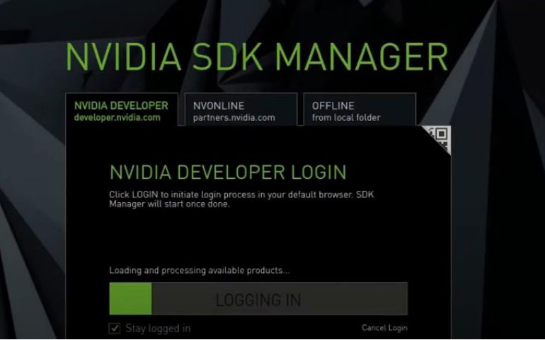
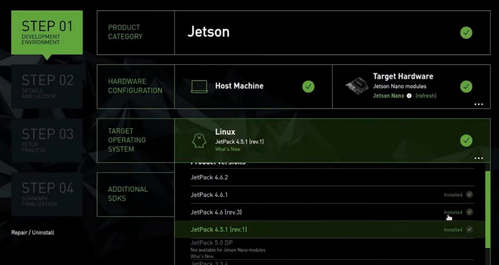

# Prepare-jetson-nano
## 👓🖱️💻🖥️ ขั้นตอนเตรียมการสำหรับ Jetson-nano
### Jetson nano
#### $\color[rgb]{1,0,1}1.$ $\color[rgb]{1,0,1}เเบบ$ $\color[rgb]{1,0,1}SD$ $\color[rgb]{1,0,1}card$
<code>https://developer.nvidia.com/embedded/learn/get-started-jetson-nano-devkit#intro</code>
##### $\color[RGB]{101, 240, 21}2.$ $\color[RGB]{101, 240, 21}แบบ$ $\color[RGB]{101, 240, 21}EMMC$ $\color[RGB]{101, 240, 21}/$ $\color[RGB]{101, 240, 21}Flash$
<p>$\color[RGB]{101, 240, 21}2.1$ Install the SDK Manager ติดตั้งใน Ubuntu 16.04, 18.04, or Ubuntu 20.04 ที่เป็น arm64</p>

> **Warning**
> ควรตรวจสอบดีๆในการลงไม่เช่นนั้นมันจะทำการติดตั้งทับกับในเครื่องเรา เพราะ NVIDIA เเนะนำให้ติดตั้งในเเบบจำลองเช่น VM WARE ที่เป็น ubuntu เพราะเซฟสุดถึงเเม้เกิดไรขึ้นก็ไม่เป็นไร!

<a href="https://developer.nvidia.com/drive/sdk-manager"><code>https://developer.nvidia.com/drive/sdk-manager</code></a>
<br><br>
<p align="center">
  
</p>
<p>$\color[RGB]{101, 240, 21}2.2$ เปิด terminal ไปที่โฟลเดอร์ที่ดาวน์โหลดเก็บไว้และติดตั้ง(ตัวอย่างเช่น Downloads)</p>

```
cd ~/Downloads
```
```
sudo apt install ./sdkmanager_[version]-[build#]_amd64.deb
```
<p>$\color[RGB]{101, 240, 21}2.3$ เปิดตัว NVIDIA SDK Manager </p>
  
```
sdkmanager
```
<p>$\color[RGB]{101, 240, 21}2.3$ ล็อกอิน NVIDIA SDK Manager</p>
<br>
<p align="center">
  
</p>

<p>$\color[RGB]{101, 240, 21}2.4$ เลือก jetpack ที่จะติดตั้ง</p>
<br>
<p align="center">
  
</p>

> **Note**
> *แนะให้เอา Deepsteam ออกเพื่อไม่ให้การ Flash ข้อมูลเกินจาก ตัว eMMC ถ้ามีแค่16GB 
<p>$\color[RGB]{101, 240, 21}2.4$ เลือก jetpack ที่จะติดตั้ง</p>
